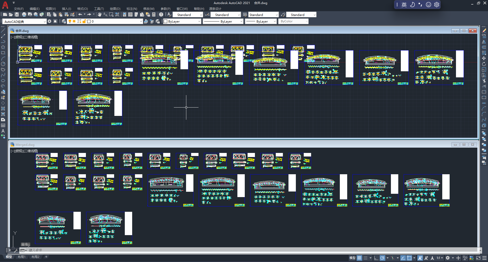
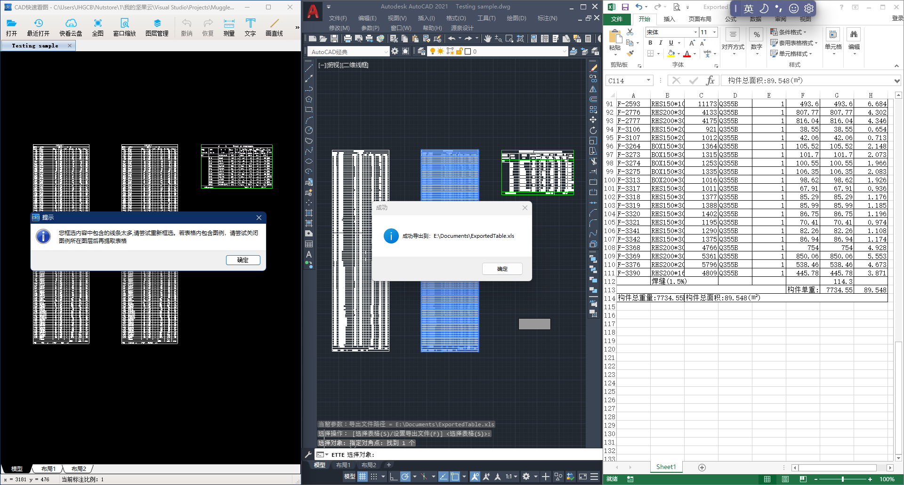

# Muggle AutoCAD-Plugins

用于AutoCAD的工具和插件。请遵守[开源协议](LICENSE)使用。

基于AutoCAD 2021版本开发，其他版本未经测试。

## DWGFilesMerger (.Net)

- 命令：MergeDWGFiles
- 功能：批量合并 *.dwg 文件

同类免费软件 [DrawingCombiner](http://www.yiyunsoftware.com/docs/#/co-start) 存在重叠问题，其实只要改变排列基点即可解决。但该软件并不开源没法修改，所以重新开发了此插件。

“DrawingCombiner”执行效率较慢，每个文件都实际打开并在 AutoCAD 窗口里呈现出来；本插件相对较快一些，文件只在后台读取处理。

## ExportTableToExcel (.Net)

- 命令：ETTE 或 ExprotTableToExcel
- 功能：将 CAD 中的假表格导出到 Excel（假表格指用线条和文字制作的表格），对块或属性块也有效。

[CAD快速看图](https://cad.glodon.com/) 带有此功能，且速度很快，但如果是很大的表格，会弹窗提示内容太多不工作，于是开发此插件。

本插件虽效率不及“CAD快速看图”，但无论表格内容多少均可使用。“CAD快速看图”应该是直接对 *.xls 文件进行读写的，所以比较快；本插件通过微软公开的 API 与 Excel 进行交互，效率较慢。

## CoordinateDimension (Lisp)

- 命令：ZB
- 功能：坐标标注

原先发布在 [明经CAD社区](http://bbs.mjtd.com/thread-170533-1-1.html) 上，现搬运到这里，并做了略微改进。
 
## Export_Text (Lisp)

- 命令：ET
- 功能：将选定的文字导出到文本文档
 
## Classic_Interface (Lisp)

- 命令：无，加载直接运行
- 功能：恢复CAD经典界面，以及一些个性化设置
 